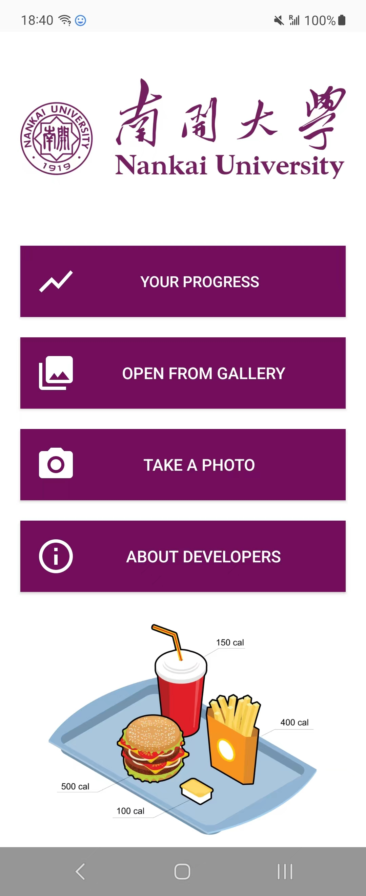
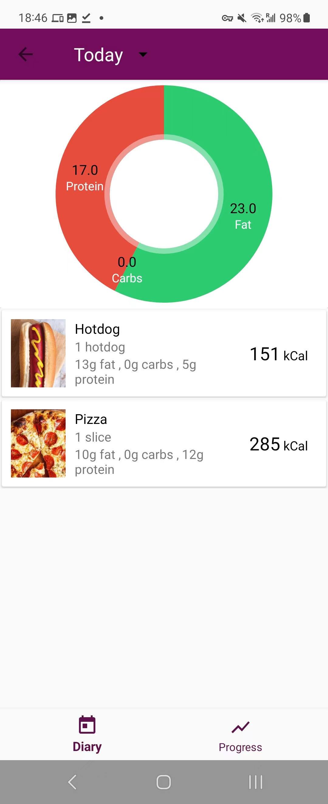
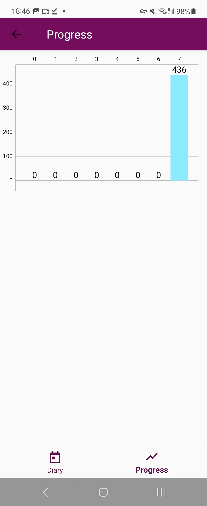
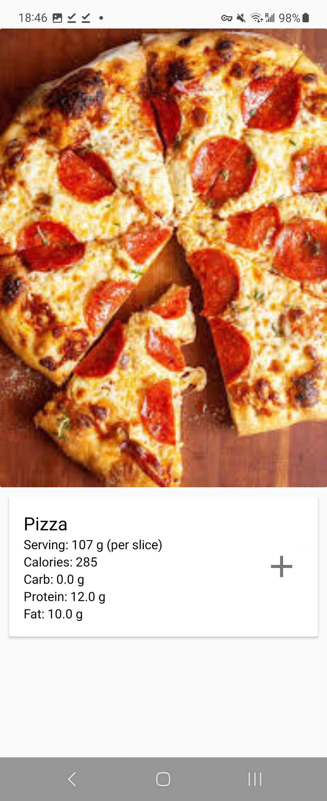
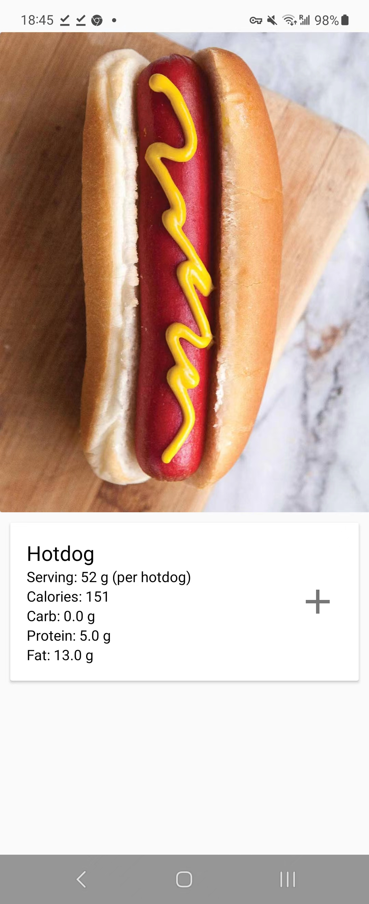
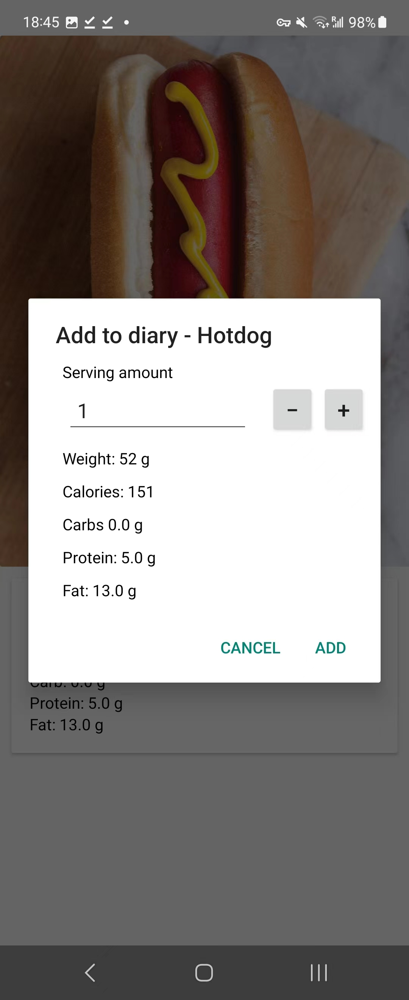

# 📱 What is FatLogger?

FatLogger is not just your ordinary Android app—it's a sophisticated tool designed to meet the needs of users who seek precise nutritional information about their meals. With its intuitive interface, users can effortlessly capture food photos, unlocking a wealth of comprehensive nutritional data at their fingertips. But FatLogger goes beyond that. It empowers users to maintain a meticulous log of their dietary choices, thanks to a convenient feature that allows them to save their food records in a dedicated diary. And that's not all—FatLogger provides a visualized analysis of eating habits, equipping users with valuable insights to make informed decisions about their nutrition.

# 💻 How It Works?

The secret behind FatLogger's accuracy lies in its cutting-edge image recognition system. Powered by a highly effective convolutional neural network (CNN), FatLogger can accurately identify and analyze food images like never before. This robust model was meticulously developed using the powerful TensorFlow framework, a beacon of excellence in the world of deep learning. The developers left no stone unturned, investing considerable effort in training the CNN with an extensive dataset comprising over 100,000 images. The result? FatLogger stands out with unparalleled accuracy and efficiency when it comes to recognizing and classifying various food items.

# 🍽️ What It Can Detect?

Prepare to be amazed by the extensive range of foods FatLogger can handle. 🍔 Sink your teeth into juicy hamburgers. 🍓 Indulge in succulent strawberries. 🥞 Savor fluffy pancakes. 🍞 Bite into crispy bread. 🌭 Relish sizzling hotdogs. 🍩 Delight in irresistible doughnuts. 🍝 Twirl your fork in flavorful spaghetti. 🍪 Enjoy crunchy crackers. 🍕 Treat yourself to a cheesy pizza. 🥛 Sip on refreshing milk. 🥒 Munch on cool cucumbers. 🍝 Satisfy your cravings with mouthwatering lasagna. 🥦 Nourish your body with nutritious broccoli. 🥚 Dive into perfectly boiled eggs. 🧁 Delight in delectable muffins. 🥭 Taste the sweetness of ripe mangoes. 🦐 Savor the freshness of shrimp. 🥬 Add crispy lettuce to your meals. 🥑 Enjoy the creamy goodness of avocados. 🍳 Relish the taste of fried eggs. 🥩 Treat yourself to a juicy steak. 🌯 Spice things up with a flavorful burrito. 🍇 Savor the sweetness of grapes. 🍉 Refresh yourself with juicy watermelons. 🍟 Satisfy your cravings with crispy French fries. 🧀 Indulge in cheesy nachos. 🍝 Enjoy a hearty plate of macaroni. 🍎 Bite into a crisp apple. 🥞 Delight in fluffy English muffins. 🥟 Savor the flavors of dumplings. 🍅 Enjoy the freshness of tomatoes. 🥓 Satisfy your cravings with crispy bacon. 🥔 Relish the comfort of baked potatoes. 🍫 Treat yourself to delicious chocolates. 🍚 Savor the grains of rice. 🍿 Enjoy the crunch of popcorn. 🍗 Indulge in crispy fried chicken. 🌮 Bite into flavorful tacos. 🍊 Delight in the citrusy goodness of oranges. 🌶️ Spice things up with chili. 🌿 Add freshness to your dishes with celery. 🥐 Enjoy a buttery croissant. 🍑 Relish the sweetness of peaches. ☕ Sip on a cup of aromatic coffee. 🍌 Nourish yourself with ripe bananas. 🌽 Enjoy the sweetness of corn. 🍦 Delight
# 👨🏻‍💻 Credits?

FatLogger was not created in isolation. It was developed as part of the Open Source project for the Master of Science in Software Engineering program at Nankai University. This impressive application is the result of the collaborative efforts of a talented team of developers:

- Samrand Hassan (Student ID: 2120226103, Email: 2120226103@mail.nankai.edu.cn)
- Mashkhal Abdalwahid Sidiq (Student ID: 2120226099, Email: 2120226099@mail.nankai.edu.cn)
- Aras Aziz Aram (Student ID: 2120226102, Email: 2120226102@mail.nankai.edu.cn)
- Brwa Hamadameen Faiq (Student ID: 2120226101, Email: brwa.hamadameen@gmail.com)
- Ngin Hama Salih Ahmed (Student ID: 2120226100, Email: 2120226100@mail.nankai.edu.cn)
- Hawzheen Mohammed Ali (Student ID: 2120226104, Email: hawzheen.ali11@gmail.com)

Their combined expertise and unwavering dedication have led to the creation of a remarkable application that exemplifies academic and professional excellence.

# 📲 How To Download Release?

To get started with FatLogger Android Universal V1.0alpha, follow these steps:

1. Visit the [Releases](https://github.com/samrandhaji/FatLogger/releases) page of the FatLogger repository on GitHub.
2. Locate the latest release, which should be labeled "Android Universal V1.0alpha."
3. Click on the release to access the release details.
4. Scroll down to the Assets section, where you will find the downloadable release package.
5. Download the package that corresponds to your Android device.
6. Once the download is complete, install the FatLogger application on your Android device.
7. Launch the app and grant any necessary permissions to ensure seamless functionality.
8. You are now ready to capture food photos, explore nutritional information, and utilize the various features offered by FatLogger.

We recommend regularly checking the [Releases](https://github.com/samrandhaji/FatLogger/releases) page for updates and new releases to ensure you have the latest version of FatLogger with all the enhancements and bug fixes.

Join the FatLogger community, take control of your nutrition, and embark on a journey towards a healthier lifestyle!

# 📺 How It's Look Like? [Screenshots]

Here are some screenshots showcasing the user interface and features of FatLogger:

## Home Screen

The home screen provides a user-friendly interface for capturing food photos and accessing nutritional information.

## Diary

The diary feature allows users to save their food records and maintain a detailed log of their dietary choices.

## Visualized Analysis

The visualized analysis feature presents users with graphical representations of their eating habits, offering valuable insights for making informed decisions about their nutrition.

## Image Recognition

FatLogger's powerful image recognition technology accurately identifies and analyzes food images, providing precise nutritional information.

## Food List

The extensive food list in FatLogger includes a diverse range of culinary options, ensuring comprehensive nutritional information for various food items.

These screenshots offer a glimpse into the intuitive interface and features of FatLogger. Experience the app firsthand by downloading and installing the latest release!

# 🎯 Conclusion

FatLogger stands as a testament to the fusion of cutting-edge technology, comprehensive nutritional analysis, and user-centric design. It's not just an app—it's a powerful tool that satisfies users' informational needs while empowering them to
